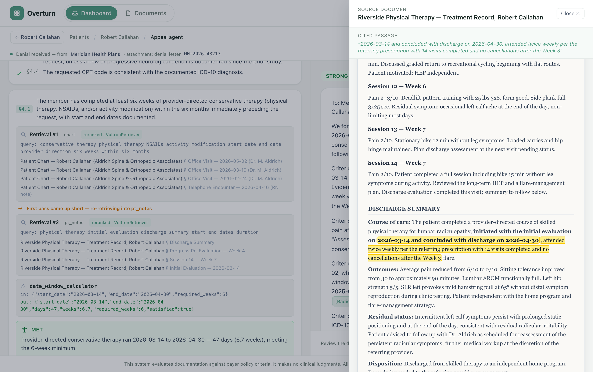
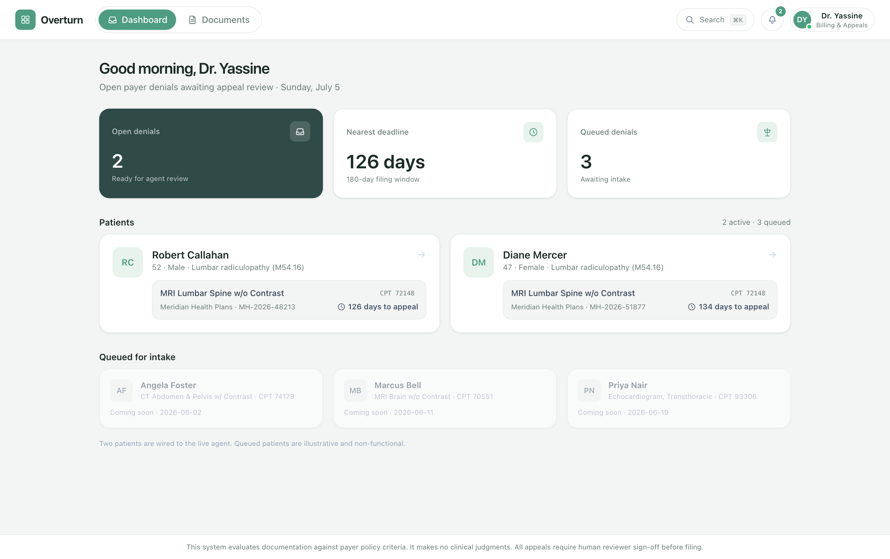
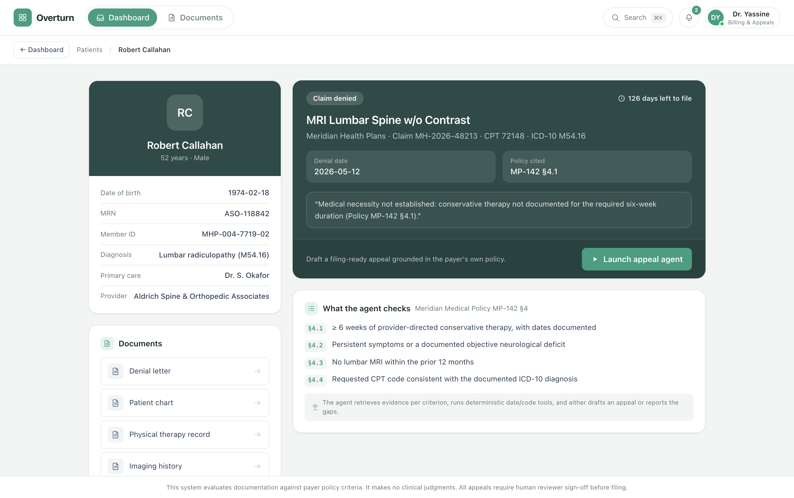
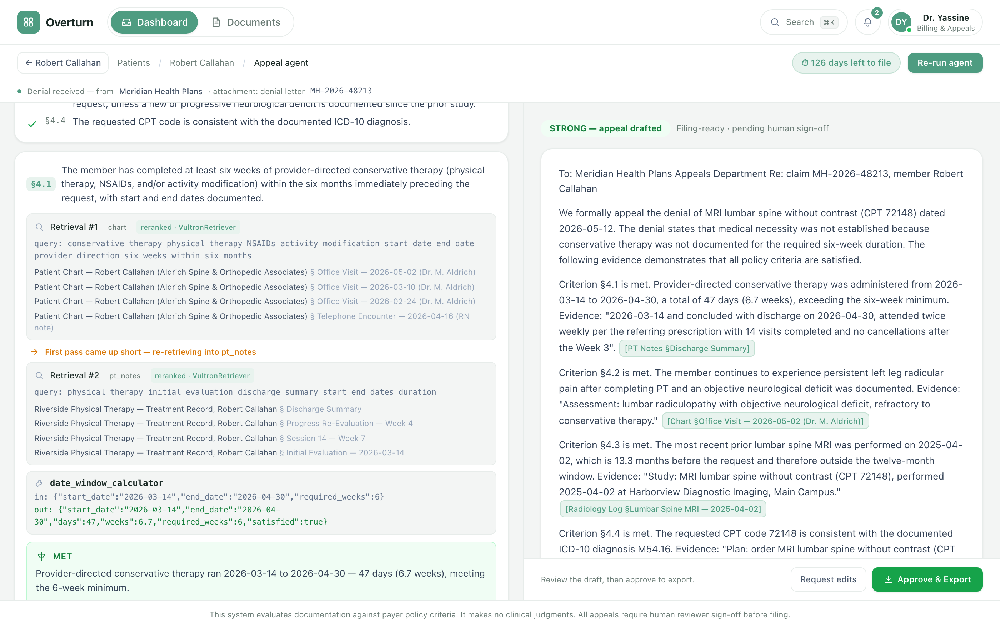
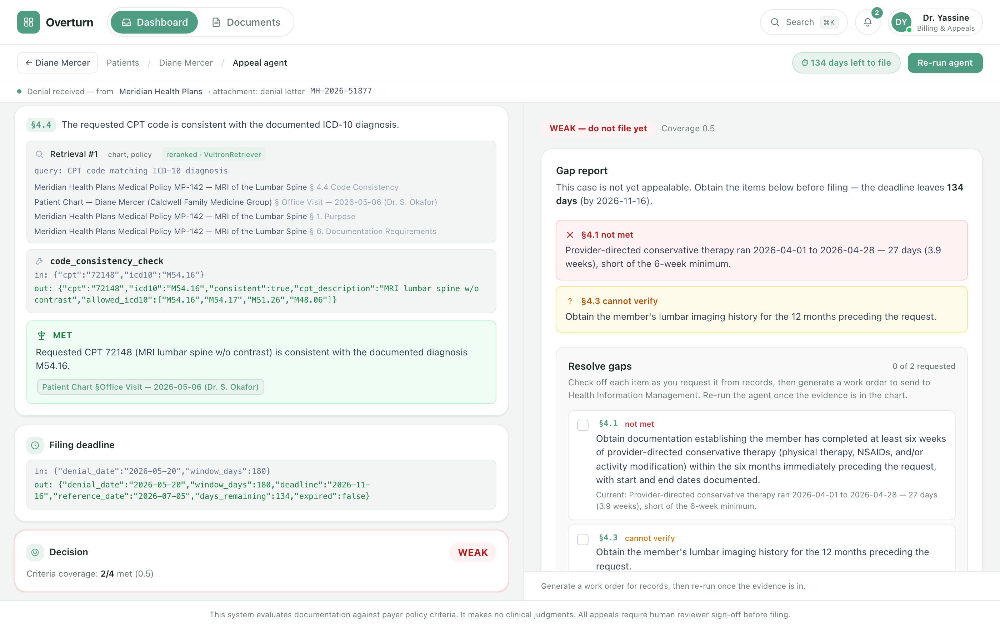
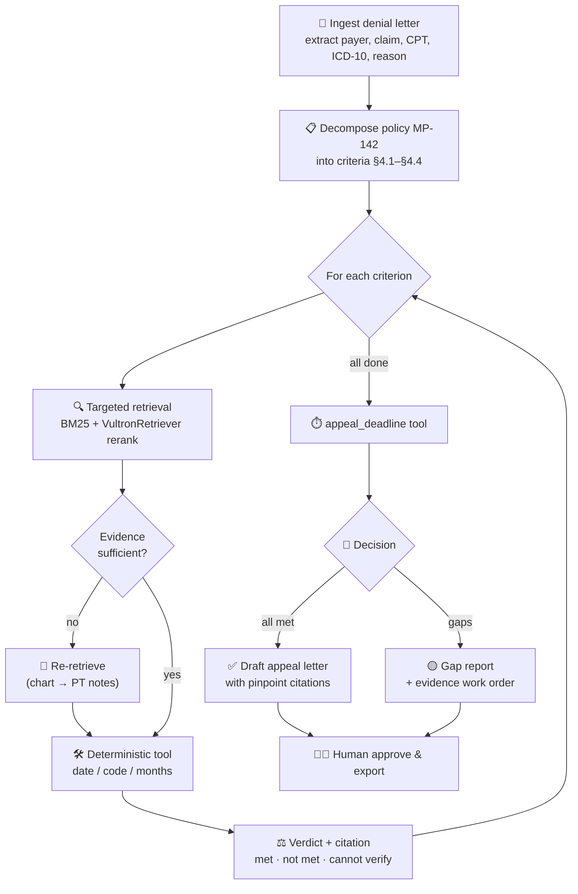

<div align="center">

# ⚖️ Overturn

### Claims Denial Appeal Agent

**A web-based enterprise agent that helps hospital billing teams fight wrongful insurance denials — grounding every decision in the insurer's _own_ published medical policy.**


_Built solo, entirely during the RAISE Summit Hackathon 2026 · Vultr track._

</div>

---

<div align="center">



_The agent searches the chart, comes up short, re-retrieves into the therapy notes, a deterministic tool confirms **6.7 weeks ≥ 6.0**, and clicking the citation highlights the buried evidence in the original record._

</div>

---

## 🩺 The problem

Health insurers deny a large share of medical claims. Appealed denials are **overturned a significant share of the time** — but **most denials are never appealed**. Not because the hospital would lose, but because writing an appeal means a biller spends **hours** cross-referencing three documents by hand:

- 📄 the **denial letter**,
- 📕 the payer's dense **medical policy**, and
- 📋 a thick **patient chart**.

The evidence that would win the appeal is often buried on page 12 of a therapy note. So hospitals **write off revenue they are owed**, and patients lose care they were entitled to.

## 💡 What Overturn does

Overturn does that cross-referencing in **about a minute**. It reads the denial letter, pulls up the insurer's own policy, breaks it into its individual medical-necessity criteria, and checks the patient's records against each one — **retrieving the specific document that can answer each criterion** and using **deterministic tools** for date math and code checks instead of guessing. Then it either:

- ✅ drafts a **filing-ready appeal letter** where every argument carries a pinpoint citation, or
- 🟡 returns an **honest gap report** — "don't file yet, here's exactly what to obtain first" — with a printable evidence **work order** for the records team.

> The insurer's own policy is the evidence standard, so the argument is one the insurer has to take seriously.

---

## 🎬 The two demo cases

| | **Case A — the insurer is wrong** 💪 | **Case B — the insurer is right** 🤝 |
|---|---|---|
| **Patient** | Robert Callahan | Diane Mercer |
| **Truth** | The 6-week therapy proof exists but is **buried deep** in a long PT note | Therapy was only **3.9 weeks**; imaging history **missing** |
| **Agent behavior** | Searches the chart → comes up short → **re-retrieves into the PT notes** → date tool confirms **6.7 weeks** → all 4 criteria met → **STRONG** | Refuses to bluff → **§4.1 not met, §4.3 cannot verify** → **WEAK** |
| **Outcome** | Filing-ready appeal letter with clickable citations | Gap report + evidence work order — **"do not file yet"** |

**Case B is what makes Case A credible** — an agent that will honestly say _"don't file this yet"_ is one an enterprise team can trust.

---

## 🖼️ A look around

**Denials worklist** — a billing specialist's morning inbox.


**Patient page** — full context, documents, and one button to launch the agent.


**Agent run** — the reasoning streams live on the left; the appeal builds on the right.


**Honest decline** — a gap report with a check-off **work order** for the records team (no faked pass, no auto-filing).


---

## 🧠 Why this is an agent, not a single retrieve-then-answer call

The Vultr track asks for a multi-step workflow that **plans, retrieves more than once when it needs to, calls tools, makes decisions, and produces an outcome a real enterprise team could actually use.** Overturn's hand-written loop maps to every one of those words:

- 🧭 **Plans** — ingests the denial into structured fields, then **decomposes the cited policy** into its four medical-necessity criteria (§4.1–§4.4).
- 🔍 **Retrieves more than once when it needs to** — a **targeted retrieval per criterion**, into the specific document type that can answer it. And it genuinely **re-retrieves on a miss**: for the therapy criterion it searches the **chart first**, finds it references PT but without dates, and **refines into the physical-therapy records** to recover them.
- 🛠️ **Calls tools** — the agent never does arithmetic itself. Pure-function tools do the load-bearing math and the trace shows their exact inputs/outputs: `date_window_calculator`, `months_since`, `code_consistency_check`, `appeal_deadline`.
- ⚖️ **Makes decisions** — each criterion gets a verdict (**met / not met / cannot verify**) bound to a citation, and the run computes an appeal **strength** (STRONG / MODERATE / WEAK) — and will **decline to file** when the evidence isn't there.
- 📤 **Produces an outcome a team can use** — a filing-ready appeal letter with inline citations, or a gap report with an actionable evidence work order. Both end at a **human "Approve & Export"** step.

## 🔬 How the agent loop works



Every step emits a live event over **Server-Sent Events**, so the UI shows the agent thinking in real time.

---

## 🧰 Tech stack

| Layer | Technology |
|---|---|
| 🤖 **Reasoning** | **NVIDIA Nemotron-Cascade-2** — planning, policy decomposition, evidence extraction, verdicts, letter drafting |
| 🎯 **Retrieval reranking** | **VultronRetriever (Prime-8B)** — reranks candidates via `/v1/rerank`; degrades gracefully to BM25-only |
| ☁️ **Inference** | **Vultr Serverless Inference** — the _only_ model provider anywhere in the code |
| 🐍 **Backend** | Python 3.11+, FastAPI, sse-starlette, rank-bm25, httpx, pydantic — **hand-written agent loop, no agent frameworks** |
| ⚛️ **Frontend** | Vite + React + TypeScript + Tailwind — one `EventSource`, component state |
| 🧪 **Data** | 9 **synthetic** documents (fictional payer _Meridian Health Plans_, fictional patients) — no real PHI |

> There is **no database**. The corpus lives as files and the retrieval index is built in memory at startup. `vultr_client.py` is the only file that talks to the inference API.

---

## 🚀 Run it locally

**Prerequisites:** Python 3.11+, Node 18+, and a **Vultr Serverless Inference API key** (create a Serverless Inference subscription in the Vultr customer portal and copy _its_ API key).

Open **two terminals** from the repo root.

**Terminal 1 — backend** 🐍
```bash
python3 -m venv .venv
.venv/bin/pip install -r backend/requirements.txt

cp .env.example .env          # then set VULTR_API_KEY to your Serverless Inference key

.venv/bin/python -m uvicorn backend.main:app --host 127.0.0.1 --port 8000
```

**Terminal 2 — frontend** ⚛️
```bash
cd frontend
npm install
npm run dev
```

Then open **http://localhost:5173**, choose a patient, and click **Launch appeal agent**. 🎉

<details>
<summary>💡 macOS note (broken <code>pip</code> in system Python)</summary>

If `python3 -m venv` produces a broken `pip`, use [uv](https://github.com/astral-sh/uv):
```bash
uv venv --python 3.12 .venv
uv pip install -r backend/requirements.txt --python .venv/bin/python
```
</details>

Headless (no UI):
```bash
PYTHONPATH=. .venv/bin/python -m backend.run_case A   # STRONG appeal
PYTHONPATH=. .venv/bin/python -m backend.run_case B   # honest gap report
```

---

## 📁 Project structure

```
overturn/
├── backend/
│   ├── main.py              # FastAPI app + SSE trace stream
│   ├── llm/vultr_client.py  # the ONLY module that talks to Vultr
│   ├── retrieval/index.py   # section-aware chunking, BM25 + rerank
│   ├── agent/loop.py        # the hand-written agent state machine
│   ├── agent/tools.py       # deterministic date/code tools
│   └── agent/prompts.py     # all prompts, as constants
├── corpus/                  # 9 synthetic documents + manifest
└── frontend/                # Vite + React + TS + Tailwind
```

---

## 🔒 Responsible use

- 🚫 **No medical advice.** The agent reasons _only_ about whether documentation satisfies the payer's written policy criteria. It never interprets symptoms, never recommends treatment.
- 🧑‍⚖️ **Human-in-the-loop.** Every appeal is gated behind a human "Approve & Export" step. The gap-report work order explicitly states that **no appeal is filed automatically**.
- 🧪 **All data is synthetic.** Fictional payer, fictional patients, fictional providers.

> **This system evaluates documentation against payer policy criteria. It makes no clinical judgments. All appeals require human reviewer sign-off before filing.**

---

## 🏆 Built at RAISE Summit Hackathon 2026

Overturn was **built entirely during RAISE Hackathon 2026 — see the commit history.** Solo, remote, Vultr track. Every model call — planning, reasoning, and retrieval reranking — runs on **Vultr Serverless Inference**.

_Overturn makes fighting a wrongful denial nearly free._ ⚖️
