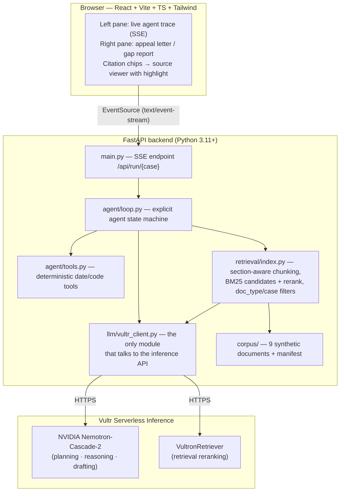

# Overturn — Claims Denial Appeal Agent

**A web-based enterprise agent that fights wrongful insurance denials by grounding every decision in the insurer's own published policy.**

Built for the RAISE Summit Hackathon 2026 (Vultr track). Planning and reasoning run on NVIDIA Nemotron; document retrieval is reranked by VultronRetriever — all served through Vultr Serverless Inference. All data is synthetic.

---

## What problem this solves

When a health insurer denies a claim, the hospital can appeal — and appealed denials are overturned a large share of the time. But most denials are never appealed, because writing an appeal means a biller spends hours cross-referencing three documents by hand: the denial letter, the insurer's dense medical policy, and a thick patient chart. The evidence that would win the appeal is often buried on page 12 of a therapy note. So hospitals write off revenue they are owed, and patients lose care they were entitled to.

**Overturn does that cross-referencing in about a minute.** It reads the denial letter, pulls up the insurer's own policy, breaks that policy into its individual medical-necessity criteria, and checks the patient's records against each one — retrieving the specific document that can answer each criterion and using exact date and code tools instead of guessing. It then either drafts a filing-ready appeal letter where every argument cites a specific document and passage, or — if the case is genuinely weak — tells the biller not to file yet and lists exactly what to obtain first. **The insurer's own policy is the evidence standard**, so the argument is one the insurer has to take seriously.

### The two demo cases

- **Case A — the insurer is wrong.** The denial claims conservative therapy wasn't documented for the required six weeks. The proof exists but is buried deep in a long physical-therapy note. The agent searches the chart, comes up short, re-retrieves into the therapy records, finds the date range, computes 6.7 weeks with a date tool, and drafts a STRONG appeal citing every criterion.
- **Case B — the insurer is right.** Same denial, different patient. Therapy was only 3.9 weeks, and the imaging history needed to verify another criterion doesn't exist in the file. The agent does **not** bluff: it returns a WEAK gap report, declines to file, and lists the exact evidence to gather before the deadline.

Case B is what makes Case A credible: an agent that will honestly say "don't file this yet" is one an enterprise team can trust.

> **This system evaluates documentation against payer policy criteria. It makes no clinical judgments. All appeals require human reviewer sign-off before filing.**

---

## Architecture



The agent loop is hand-written — no LangChain, no LlamaIndex — so every step is explicit and traceable. There is no database: the corpus lives as files and the retrieval index is built in memory at startup. `vultr_client.py` is the only file that talks to the inference API.

---

## Why this is an agent, not a single retrieve-then-answer call

The Vultr track requires a multi-step workflow that **plans, retrieves more than once when it needs to, calls tools, makes decisions, and produces an outcome a real enterprise team could actually use.** Overturn's loop maps to each of those words:

- **Plans.** Step 1 ingests the denial letter into structured fields and states a plan; Step 2 decomposes the cited policy into its individual medical-necessity criteria (§4.1–§4.4) — a checklist the rest of the run works through.
- **Retrieves more than once when it needs to.** Retrieval is *per criterion*: each criterion runs its own targeted search into the specific document type that can answer it (therapy notes, chart, radiology log). And it genuinely re-retrieves when the first pass falls short — for the conservative-therapy criterion the agent searches the **chart first**, finds the therapy referenced but without dates, and **refines into the physical-therapy records** to recover them. That second retrieval is conditional: it fires because the first came up short, not on a script.
- **Calls tools.** The agent never does arithmetic itself. Deterministic pure-function tools do the load-bearing math and the trace shows their exact inputs and outputs: `date_window_calculator` (therapy duration vs. the 6-week rule), `months_since` (the 12-month prior-imaging window), `code_consistency_check` (CPT/ICD pairing), and `appeal_deadline` (days left in the 180-day filing window).
- **Makes decisions.** Each criterion gets a verdict — met / not met / cannot verify — bound to a citation, with the tool result authoritative over any guess. The run then computes an appeal strength (STRONG / MODERATE / WEAK) and coverage score, and critically will decline to file when the evidence isn't there.
- **Produces an outcome a real enterprise team could use.** A STRONG case yields a filing-ready appeal letter addressed to the payer's appeals department, disputing the specific denial reason, with every factual argument carrying an inline citation a biller can click to see the source passage highlighted. A weak case yields a gap report with a concrete evidence checklist and the filing deadline. Both end at a human "Approve & Export" step.

A single retrieve-then-answer call cannot decompose a policy, retrieve differently per criterion, re-retrieve on a miss, run deterministic tools, and choose between drafting and declining. Overturn does all of it, and the left-pane trace makes each step visible as it happens.

---

## Tech stack

- **Inference — Vultr Serverless Inference (only).** No other model provider anywhere in the code.
  - **NVIDIA Nemotron-Cascade-2-30B** — planning, policy decomposition, evidence extraction, verdicts, and letter drafting.
  - **VultronRetriever (Prime-8B)** — reranks retrieval candidates via the `/v1/rerank` endpoint. Retrieval degrades gracefully to BM25-only ordering if reranking is unavailable, so a run never blocks on it.
- **Backend** — Python 3.11+, FastAPI, sse-starlette (SSE streaming), rank-bm25 (candidate generation), httpx, pydantic. Hand-written agent loop; no agent frameworks.
- **Frontend** — Vite + React + TypeScript + Tailwind. One `EventSource`, component state, no router or state library.
- **Data** — 9 synthetic Markdown documents (fictional payer *Meridian Health Plans*, fictional patients). No real PHI, no real insurer names, no scraped documents.

---

## Run it locally

**Prerequisites:** Python 3.11+, Node 18+, and a **Vultr Serverless Inference API key** (create a Serverless Inference subscription in the Vultr customer portal and copy its API key).

Open two terminals from the repo root.

### Terminal 1 — backend

```bash
# create a virtual environment (Python 3.11+)
python3 -m venv .venv
.venv/bin/pip install -r backend/requirements.txt

# configure credentials
cp .env.example .env
# then edit .env and set VULTR_API_KEY to your Vultr Serverless Inference key

# run the API (http://127.0.0.1:8000)
.venv/bin/python -m uvicorn backend.main:app --host 127.0.0.1 --port 8000
```

> On some macOS setups the system `python3 -m venv` produces a broken `pip`. If so, use [uv](https://github.com/astral-sh/uv) instead:
> ```bash
> uv venv --python 3.12 .venv
> uv pip install -r backend/requirements.txt --python .venv/bin/python
> ```

### Terminal 2 — frontend

```bash
cd frontend
npm install
npm run dev
```

Open **http://localhost:5173**, choose **Case A**, and click **Run agent**. The Vite dev server proxies `/api` to the backend on port 8000, so both terminals must be running. Watch the left pane stream the agent's reasoning (including the chart → PT-notes re-retrieval), click a citation chip in the letter to see the source passage highlighted, then switch to **Case B** to see the honest gap report.

Headless check without the UI:

```bash
PYTHONPATH=. .venv/bin/python -m backend.run_case A
PYTHONPATH=. .venv/bin/python -m backend.run_case B
```

---

## Notes

- **Deterministic by design.** All model calls run at temperature 0.2 with reasoning disabled; the mechanical verdicts are decided by the deterministic tools. The two demo cases produce the same outcome on every run.
- **No medical advice.** The agent reasons only about whether documentation satisfies the payer's written policy criteria. It never interprets symptoms, never recommends treatment, and every output is gated behind human sign-off.

Built entirely during RAISE Hackathon 2026 — see the commit history.
